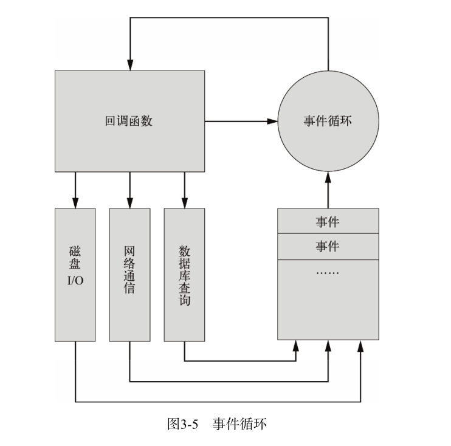

## 第三章 Node.js 快速入门

### 3.1 开始用 Node.js 编程
- 3.1.1 Hello World
- 3.1.2 Node.js 命令行工具
- 3.1.3 建立 HTTP 服务器

### 3.2 异步式 I/O 与事件式编程
- Node.js最大的特点就是异步式I/O（或者非阻塞I/O）与事件紧密结合的编程模式。这种模式
    与传统的同步式I/O线性的编程思路有很大的不同，因为控制流很大程度上要靠事件和回调函数来
    组织，一个逻辑要拆分为若干个单元。
- **3.2.1 阻塞与线程**
    + 什么是阻塞（block）呢？线程在执行中如果遇到磁盘读写或网络通信（统称为I/O操作），
        通常要耗费较长的时间，这时操作系统会剥夺这个线程的CPU控制权，使其暂停执行，同时将
        资源让给其他的工作线程，这种线程调度方式称为阻塞。当I/O操作完毕时，操作系统将这个
        线程的阻塞状态解除，恢复其对CPU的控制权，令其继续执行。这种I/O模式就是通常的
        同步式I/O（Synchronous I/O）或阻塞式I/O（BlockingI/O）。
    + 异步式I/O（AsynchronousI/O）或非阻塞式I/O（Non-blockingI/O）则针对所有
        I/O操作不采用阻塞的策略。当线程遇到I/O操作时，不会以阻塞的方式等待I/O操作的
        完成或数据的返回，而只是将I/O请求发送给操作系统，继续执行下一条语句。当操作系统
        完成I/O操作时，以事件的形式通知执行I/O操作的线程，线程会在特定时候处理这个事件。
        为了处理异步I/O，线程必须有事件循环，不断地检查有没有未处理的事件，依次予以处理。
    + 单线程事件驱动的异步式 I/O 比传统的多线程阻塞式 I/O 究竟好在哪里？<br/>
      A: 简而言之，异步式 I/O 就是少了多线程的开销。对操作系统来说，创建一个线程的代价是
         十分昂贵的，需要给它分配内存、列入调度，同时在线程切换的时候还要执行内存换页，
         CPU 的缓存被清空，切换回来的时候还要重新从内存中读取信息，破坏了数据的局部性。① <br/>
      ①: 基于多线程的模型也有相应的解决方案，如轻量级线程（lightweight thread）等。
         事件驱动的单线程异步模型与多线程同步模型到底谁更好是一件非常有争议的事情，因为尽管
         消耗资源，后者的吞吐率并不比前者低。

- **3.2.2 回调函数**
    + 让我们看看在 Node.js 中如何用异步的方式读取一个文件, 下面是一个例子:
      ```javascript
        // - readfile.js
        let fs = require("fs");
        fs.readFile("file.txt", "utf-8", function(err, data) {
            if (err) {
                console.log(err);
            } else {
                console.log(data);
            }
        })
        console.log("end.");
      ```

- **3.2.3 事件**
    + Node.js 所有的异步 I/0 操作在完成时都会发送一个事件到事件队列。在开发者看来，事件由
      EventEmitter 对象提供。
    + (1) Node.js 的事件循环机
        - Node.js 在什么时候会进入事件循环呢？答案是 Node.js 程序由事件循环开始，到事件
          循环结束，所有的逻辑都是事件的回调函数，所以 Node.js 始终在事件循环中，程序入口
          就是事件循环第一个事件的回调函数。事件的回调函数在执行的过程中，可能会触出 I/O 
          请求或直接发射（emit）事件，执行完毕后再返回事件循环，事件循环会检查事件队列中
          有没有未处理的事件，直到程序结束。图3-5说明了事件循环的原理。
        - 与其他语言不同的是，Node.js 没有显式的事件循环，类似 Ruby 的 
          `EventMachine::run()` 的函数在 Node.js 中是不存在的。Node.js 的事件循环
           对开发者不可见，由 `libev` 库实现。 libev 支持多种类型的事件，如 `ev_io` 、
          `ev_timer`、`ev_signal`、`ev_idle`等，在 Node.js 中均被 EventEmitter
          封装。 libev 事件循环的每一次迭代，在 Node.js 中就是一次 `Tick`， libev 
          不断检查是否有活动的、可供检测的事件监听器，直到检测不到时才退出事件循环，进程结束。  
        - 
    + EventEmitter 实现的源码见: `Programming-Video-Learning-W\珠峰培训` `-`
      `\05_Node.js-张仁阳\05_正式课实录\events.js`    

### 3.3 模块和包
- 模块(Module) 和 包(Package) 是 Node.js 最重要的支柱。Node.js 提供了 require 函数
  来调用其他模块，而且模块都是基于文件的，机制十分简单。
- 模块和包没有本质的区别，如果要辨析，那么可以把包理解成是实现了某个功能模块的集合。
- **3.3.1 什么是模块？**
    + 模块是 Node.js 应用程序的基本组成部分，一个 Node.js 文件就是一个模块。 例如 
      `let http =require("http");`, 其中 http 就是 Node.js 的一个核心模块，其内部
      是用 C++ 实现的。外部用 javascript 做封装。
- **3.3.1 创建及加载模块:**
- **3.3.3 创建包:**
    * 包是模块基础上更深一步的抽象， Node.js 的包类似于 C/C++ 的函数库或者 Java/.Net 的
      类库。它将某个独立的功能封装起来，用于发布、更新、依赖管理和版本控制。 Node.js 根据
      Common.js 规范实现了包机制，开发了 npm 来解决包的发布和获取需求。
    * Node.js 的包是一个目录，其中包含一个 JSON 格式的包说明文件 package.json。严格符合
      CommonJS 规范的包应该具备以下特征:
        + `package.json` 必须在包的顶层目录下
        + `bin (binary)` 目录下放 "二进制文件"
        + `lib (library 文库)` 目录下放 "javascript 代码"
        + `doc (document)` 目录下放 "文档"
        + `test` 目录下放 "单元测试"
- **3.3.4 Node.js 的包管理器:** 
    + npm (npm 之于 Node.js, 就像 pip 之于 Python, gem 之于 Ruby, pear 之于 PHP, 
      CPAN之于 Perl... 同时也像 apt-get 之于 Debian/Ubutnu，yum 之于 
      Fedora/RHEL/CentOS, homebrew 之于 MAC OS X)
