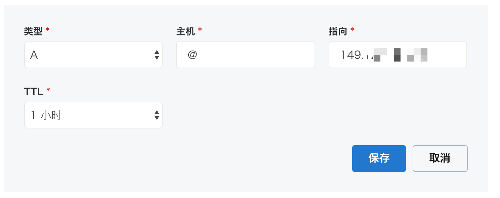
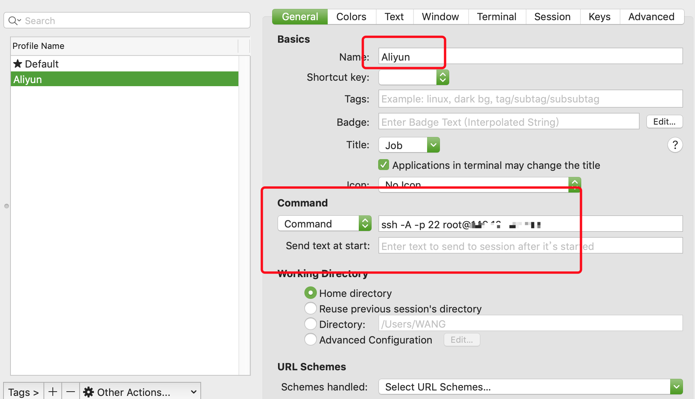
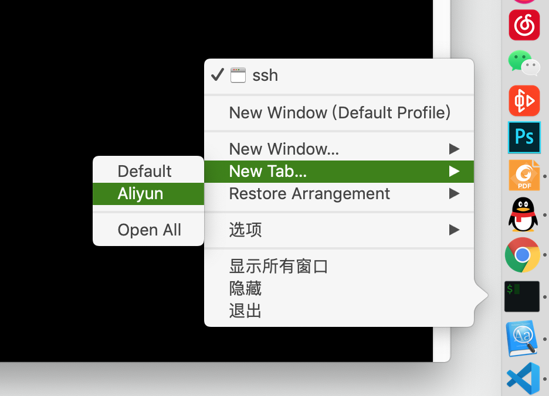

# 建站

## 目录(Catalog)
0. 前置知识: 主机与服务器的区别
1. 建站的大致流程:
    + 1.1 购买云服务器
    + 1.2 购买域名, 解析域名到服务器`IP`
    + 1.3 熟悉 `Linux`系统, 以及 `SSH` 和 `Linux SCP` 命令.
        + 1.3.1 熟悉 `Linux` 系统.
        + 1.3.2 什么是 `SSH`?
        + 1.3.2 什么是 `Linux SCP` 命令?
    + 1.4 安装服务器软件
    + 1.4 部署 `NodeJS` 项目到服务器
    + 1.4 上传网站文件
    + 1.5 浏览网站

## 生词 (New Words)
- **elastic [ɪ'læstɪk] --adj.弹性; 伸缩; 灵活. --n.皮筋儿; 松紧带**
    + an elastic(adj) string. 松紧带.
    + an elastic(adj) band. 橡皮筋.
    + Elastic Computer Service. 弹性计算机服务.
    + The elastic in my clothes has gone. 我衣服上的松紧带松了.
- **secure [sɪ'kjʊə] --adj.安全的; 牢固的. --vt.保护; 保管**
    + This building would be secure(adj) in an earthquake.
      这栋建筑遇到地震不会有危险.
    + a secure(adj) victory. 确实可靠的胜利.
    + He feels secure(adj) about his future. 他对自己的未来感到放心.
    + Is the door secure(adj)? 门关好了吗?
- **shell [ʃɛl] --n.壳,外壳; 贝壳. --v.剥; 炮击**   
- **profile ['prəʊfaɪl]  --n.轮廓; 侧面; 外形; 简介. --vt.用数据、图表表示**
    + Profile name 档案名称
    + Bluetooth profile 蓝牙规范
    + company profile 公司简介
    + temperature profile 温度曲线

## 内容 (Content)
2. [部署 Node.js 环境](https://help.aliyun.com/document_detail/50775.html)
3. [部署 `NodeJS` 项目到服务器参考文章](http://www.kovli.com/2017/09/19/ecs-deploy/)

### 0. 前置知识: 主机与服务器的区别
- [来源-知乎]()
- 这个问题的起源是电脑制造商乱用名字, 最早的计算机没有所谓 `服务器` 这个称谓.
  服务器是一个软件概念, 通过网络向其他电脑提供信息或者服务的软件被称为 `服务端/server`,
  负责接收和用户交互的软件被称为 `客户端/client`, 后来因为制造厂商为了强调计算机的用途,
  把那些专门用来 24 小时开机, 通过网络提供服务的计算机称为 `服务器/server`, 
  中文翻译不同但是英文里面跟软件的服务端是同一个单词. 后来这种叫法传开之后, 
  服务器一般指代那些 24 小时不间断工作的, 用于通过网络向个人用户提供服务的计算机, 
  本质上还是计算机而已, 所以任何有计算和网络功能的计算机只要上面有运行服务端软件, 
  都可以被称为 `服务器`. 所以别说个人计算机, 连手机, 平板按照上说的说法都是 `服务器`.
  当然, 现在的专用服务器在各个方面都做了很多特异化的设置适合于上面的使用环境, 比如:
  双网口, ECC校验, 双电源或者多电源冗余, 硬件 RAID 硬盘, 15000转的 SAS 硬盘, 
  高级的网络芯片(别看都是千兆网口, 服务器专用的可以承受相当大的负载, 
  而一般的个人用网口没有经过特殊设计如果经受高流量冲击听说甚至会起火),
  更快也更大的网络接口比如 Infiniband 和 FC. 总之设计思想就是稳定和性能压倒一切. 

### 1. 建站的大致流程:
#### 1.1 购买一台服务器, 服务器建议买 `阿里云服务器`, `云服务器` 分为 2 类:
- (1) `虚拟云服务器(ECS: Elastic Computer Service)`
    + 看到网上说阿里新推出的基于 `ECS` 发展出来的的轻量应用服务器更好用,
      所以暂时先买了 3 个月的 `轻量应用服务器`, 后续看怎么样吧...
        - Note: `轻量应用服务器` 会预装一些开发工具, 比如我使用 `NodeJS` 开发后台,
          我就直接选择 ` NodeJS` + `CentOS`, 不仅会安装好 `NodeJS`,
          还会预先安装好 `NVM`, `Express`... 方便很多. 
- (2) `独立主机` (即: 购买一台云端的独立主机, 太贵买不起.)
- Added: 添加一下`服务器备案`的解释:
    + (a) 为什么国内的 `云服务器` 要`备案`?  A: 在天朝你懂的! 
    + (b) 有哪些 `云服务器` 不需要备案?
        - 阿里云'香港服务器'和'国外服务器'都不需要备案.
    + (c) 阿里云免备案服务器中的香港服务器和国外服务器有什么区别呢?
        - 阿里云香港服务器服务器部置在香港. 国外服务器服务器部署在国外.
          在亚太地区, 称为阿里云亚太服务器, 在欧洲称为阿里云欧洲服务器, 
          在美国称为阿里云美国服务器. 这些服务器都是免备案, 购买后,
          就可以使用, 非常方便. 
#### 1.2 购买域名, 解析域名到服务器`IP`: 
- 域名我是从 `godaddy` 上买的(Note: 原因是国外的域名不需要备案),
  但阿里云服务器不能解析非阿里云购买的域名, 解决方法就是回到 `godaddy`
  点击用户头像 --> `我的产品` --> `DNS` --> `DNS 管理` 页面, 点击 `添加`
  按钮, 按照下图设置 `DNS 解析`:  
    
  Note: 图中的 `指向` 是阿里云虚拟服务器中你购买的服务中的公网 `IP 地址`,
  可以在 `用户` --> `我的订单` --> `概览` 的服务器信息下查看.

#### 1.3 熟悉 `Linux`系统, 以及 `SSH` 和 `Linux SCP` 命令.
- 1.3.1 熟悉 `Linux` 系统.
    + 见当前仓库: `./Linux-Learning/README.MD`
- 1.3.2 什么是 `SSH`?
    + 见当前仓库: `./SSH-learning/SSH-详解.md`
- 1.3.2 什么是 `Linux SCP` 命令?

#### 1.4 安装服务器软件
- 如果你购买的是 `阿里云ECS` 虚拟主机, 那么就需要安装自己语言
  (e.g.: Node/Java/PHP/python) 相对应的服务器软件,
  因为虚拟主机就相当于一台完整的电脑, 只不过系统是 Linux 的; 因为我购买的是 
  `轻量应用服务器`, 我使用 NodeJS 开发, 相对应的服务器运行软件已经提前安装好,
  不用自己再手动安装.

### 云服务器的基本使用
- [来源](https://zhuanlan.zhihu.com/p/47194584)
- 因为我们要远程访问我们的服务器, 所以我们需要一些 `工具(shell)` 去和它进行交互。
  Windows 下因为 Windows 的 `cmd` 或者说 `powershell` 不支持 Unix/Linux 系统的那些
  `bash` 命令, 所以我们需要一款支持这些命令的软件 `putty` 去帮助我们.

  同时, 因为我们经常会有向 服务器上传/下载文件 的需求, 所以我们用 `WinSCP`
  这款工具来帮助我们.
    + Added-01: 什么是 `WinSCP`?  A: 它是可以让你在 windows 下书写
      `Linux SCP` 命令的软件, 因为一般的中小服务器都是使用的 Linux 系统,
      所以我们需要一个软件可以在 Windows 下写 `Linux SCP` 命令, `WinSCP`
      既是这样一款软件.
    + Added-02: 什么是 `Linux SCP`?  A: `Linux scp` 是一种用于 Linux 
      系统之间**复制文件和目录**的命令. (即: 向服务器上传/下载文件)
        - `scp` 是 `secure copy` 的缩写, `scp` 是 Linux 系统下基于 `SSH`
          登录进行安全的远程文件拷贝命令.
        - `scp` 是加密的, `rcp` 是不加密的, `scp` 是 `rcp` 的加强版.

  对于 Mac 用户来讲呢, 因为 macOS 就是基于 Unix 开发的, 所以在 Mac
  自带的终端内直接 `SSH` 就可以连接到云服务器啦. 但是自带的终端略丑且功能称不上强大,
  所以我们用最流行的 Mac 下的终端软件 `iTerm` 去帮助我们获得更好的体验. 
    + 什么是 `SSH`? [Secure Shell - Wiki](https://zh.wikipedia.org/wiki/Secure_Shell)
        + `Secure Shell`(安全外壳协议, 简称 `SSH`) 是一种加密的网络传输协议, 
          可在不安全的网络中为网络服务提供安全的传输环境[1]. 
          `SSH` 通过在网络中创建安全隧道来实现 `SSH` 客户端与服务器之间的连接[2]. 
          虽然任何网络服务都可以通过 `SSH` 实现安全传输, 但 `SSH`
          最常见的用途是远程登录系统, 人们通常利用 `SSH` 来传输命令行界面和远程执行命令.
          `SSH` 使用频率最高的场合是类Unix系统, 但是 Windows 操作系统也能有限度地使用SSH.

  同时对于喜爱 VSCode 的同学, 我们还介绍了一款插件去让我们所有的工作全部在 VSCode 完成. 
- 上云 -- 登录:
    + (1) 打开终端 (`iTerm2/putty`, 本文使用 iterm2)
    + (2) 在终端中输入 `ssh Your_Server_IP_Address` (149.129.46.205)
        + 解决输入上面的 `ssh xxxx` 后, 报 `Permission denied, please try again.`
          错误的问题:
            - [参考文章](https://www.jianshu.com/p/590b9d699b44)
            - 解决方法: 打开 `iterm2` 通过 `iTerm2` --> `Preferences` -->
              `Profiles` 增加一个 `Profile`
              
            - 上图的 `ssh -A -p 22 root@阿里云服务器公网IP`, `ssh -A -p 22`
              为固定写法, `root`为服务器账号, `@IP`为服务器公网IP.
            - 接下来打开 iTerm2 按照下面打开终端:
              

    + (3) 输入用户名和密码: 打开 阿里云登录个人账号后, 点击左上角的 `三` 展开后, 找到
      最近使用的 `轻量级应用服务器`, 点击进入, 在左侧的导航栏找到 `服务器运维` --> 
      `远程连接` 便可看到 `IP 地址` 和 `账号`.
    + (4) 成功登录后会看到阿里云的欢迎语.  

### Mac 下使用 `VSCode` 编辑服务器的文件
- [文章来源](https://zhuanlan.zhihu.com/p/47190846)
- MacOS 系统下普遍吐槽没有很好用的 `SCP` 应用（也有可能是我还没发现).
  推荐比较多的`FileZilla` 后发现也不如 Windows 下强大的 `WinSCP`.
  
  说起 `WinSCP`, 最让我怀念它的倒不是极其方便的上传文件功能, 毕竟 `scp` 命令也没多长,
  不用工具也可以解决, 而是它可以右键服务器上的文件进行在线编辑, 感觉比较方便.

  不过在 `MacOS` 上我们可以使用 vscode + 安装 `Remote VSCode` 插件的方法来实现这个功能:
    + 环境: 
        - 本地：`MacOS` + `VSCode`
        - 服务器：`CentOS 7.3`
  
  VSCode内安装插件
    + 打开 VSCode, 在应用商店中搜索 `Remote VSCode`. (Tip: remote vscode
      同样也支持 windows).
    + 安装插件后重启 VSCode.
- 服务器上安装 `rmate` 组件 (tip: 这里的前提是服务器已经正常配置好, 并可以正常访问了.)
    + (1). 打开服务器, 并执行以下命令
      `$ sudo wget -O /usr/local/bin/rmate https://raw.github.com/aurora/rmate/master/rmate`  
      `$ sudo chmod a+x /usr/local/bin/rmate`
- 现在回到 vscode 使用这一插件
    + (1) 在 vscode 中打开命令行窗口(`Command + Shift + p`), 执行
      `>Remote: Start Server` 命令. (Tip: 这一步是开启 MacOS 的 `52698` 端口,
      保持 `TCP` 连接, 等待请求.)
        - 为什么是 `52698` 端口?
            + `52698` 是 `Remote VSCode` 插件的默认端口, 你可以在
              `User Preference (偏好设置)` 页面内搜索
              `Remote VSCode configuration` 来改变它. 
    + (2) 第一步完成后, 在 VSCode 内打开一个新的终端输入以下命令连接到你的 Linux 服务器:
      `$ ssh -R 52698:localhost:52698 VIRTUAL_MACHINE_IP_ADDRESS` (tip:
      "VIRTUAL_MACHINE_IP_ADDRESS" 就是你的服务器IP地址).
    + (3) 在你的 VSCode 终端内, 执行 `rmate` 命令来编辑你想编辑的文件.
      会看到服务器上的文件内容会在 VSCode 里面自动就显示出来啦!
      这时你再保存也是同步保存到服务器上的. 你也同样可以在 VSCode 的终端里执行命令比如:
      `python test.py` 之类。也就是说只需要一个 VSCode 就可以完成连接、编辑、保存、
      执行操作. (就差一个 SFTP 上传插件了）